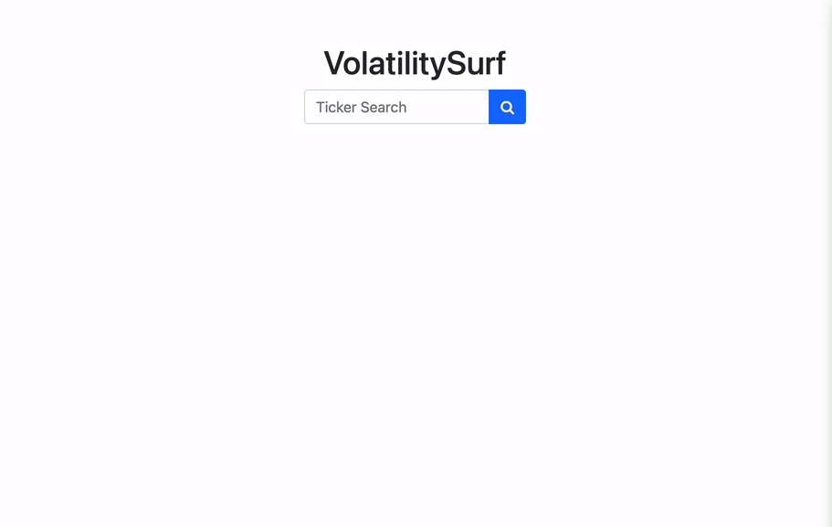

# *VolatilitySurf*
> At its core, VolatilitySurf is an open source stock options trading tool. It's a collaborative open source work-in-progress that allows the user to search by ticker for real-time stock option data, and interact with  implied volatility surface data visualizations.
<!-- > Live demo [_here_](https://www.example.com). --> <!-- Once a live deployment is available, include the link here. -->

## Table of Contents
* [General Info](#general-information)
* [Technologies Used](#technologies-used)
* [Features](#features)
* [Screenshots](#screenshots)
* [Project Status](#project-status)
* [Room for Improvement](#room-for-improvement)
* [Acknowledgements](#acknowledgements)
* [Contact](#contact)
<!-- * [License](#license) -->

<!-- PLACE BETWEEN SCREENSHOTS AND PROJECT STATUS WHEN IMPLEMENTING
* [Setup](#setup)
* [Usage](#usage)
-->

## General Information
<!--
- Provide general information about your project here.
- What problem does it (intend to) solve?
- What is the purpose of your project?
- Why did you undertake it?
-->
As fellow students in full stack development, collaborators Erik van Erp, David Moore, and Coren Frankel sought to build a first draft for open source volatility surface rendering--financial data visualizations that the exclusive Bloomberg Terminal service dominates. *VolatilitySurf* is a Java web app project that has evolved to encapsulate the volatility surface rendering namesake with a minimalist ticker search function and real-time stock market options data presented in conventional format and with simple but sleek User Interface.
<!-- You don't have to answer all the questions - just the ones relevant to your project. -->

## Technologies Used
- Java 8
- Spring Boot - version 2.7.3
- JavaScript libraries: 
   + Plotly.js 
   + D3.js
- Bootstrap
- MBoum API
- MySQL - version 8.0.28

## Features
<!-- List the ready features here: -->
- Minimalist Ticker home page with form search
- Real-time stock options data conditionally rendered in table format akin to Yahoo! Finance
- More on the way! (Rendered implied volatility surfaces coming soon)

## Screenshots
<!-- If you have screenshots, gifs, video demos you'd like to share, include them here. -->

<!--
## Setup
What are the project requirements/dependencies? Where are they listed? A requirements.txt or a Pipfile.lock file perhaps? Where is it located?

Proceed to describe how to install / setup one's local environment / get started with the project.

## Usage
How does one go about using it?
Provide various use cases and code examples here.

`write-your-code-here`

-->
## Project Status
Project is: 🏗️ _in progress_

Active Contributors: 
  + [Erik van Erp](https://github.com/ErikvanErp) (Lead Full Stack Developer, UI/UX Designer)
  + [Coren Frankel](https://github.com/coren-frankel) (Full Stack Developer, DevOps)
<!-- _in progress_ / _complete_ / _no longer being worked on_. If you are no longer working on it, provide reasons why. -->

## Room for Improvement
<!-- Include areas you believe need improvement / could be improved. Also add TODOs for future development. -->

Room for improvement:
- The lag after search initiation is due to the great size of the data being collected and will soon be augmented (i.e. loading animation, asynchronous loading). Currently we are calling and collecting many 1000s of data entries and immediately loading them all. Thus in version 0.1 our drop down list meant to separate the options by date is unfinished, and the table stretches the page to an unreadable length.
- Rather than using the implied volatility value given from MBoum API, Erik intends to calculate our own implied volatility for improved accuracy in the data visualizations.

To do:
- Provide data filtering by options expiration date manipulated by drop down
- Compile coordinates for d3/plotly to render as a real volatility surface
- Integrate loading animations where necessary
- Break up option data creation to increase loading speed

## Acknowledgements
<!-- I think you could do this section more justice Erik. Here's a "template/rough draft"-->
- This project was inspired by a series of conversations between Erik Van Erp and (a colleague) regarding the intriuging calculation and rendering of volatility surface plots as a means to identify opportune stock options trades...
In its inception, VolatilitySurf was a demonstration of our collective ability to research, digest, and develop from many points of ignorance (i.e. financial, technical, logistical) to produce a useful and openly available trading tool with a minimalist yet interactive design.
- This project was partially inspired by:
    + Collective open source financial tools like [OpenBB Terminal](https://www.openbb.co/products/terminal)
    + Stock options display by [Yahoo! Finance](https://finance.yahoo.com/quote/GOOG/options?p=GOOG)
    + The roughly $2K/month [Bloomberg Terminal](https://www.bloomberg.com/professional/contact-menu/?utm_source=bloomberg-menu&utm_medium=bcom&bbgsum=DG-WS-PROF-DEMO-bbgmenu)
- Many thanks to [David Moore](https://github.com/dav1dmoore) for his early contributions in researching and applying robust and dynamic data visualizations from the Plotly.js and D3.js libraries.

## Contact 
+ [Coren Frankel](https://linkedin.com/in/coren-frankel): feel free to [email me](mailto:coren.frankel@gmail.com)!
+ Erik van Erp
<!-- I'M NOT SURE WHAT YOU'D LIKE TO DISCLOSE, LINK TO? DISCUSS -->

<!-- Optional -->
<!-- ## License -->
<!-- This project is open source and available under the [... License](). -->

<!-- You don't have to include all sections - just the one's relevant to your project -->
